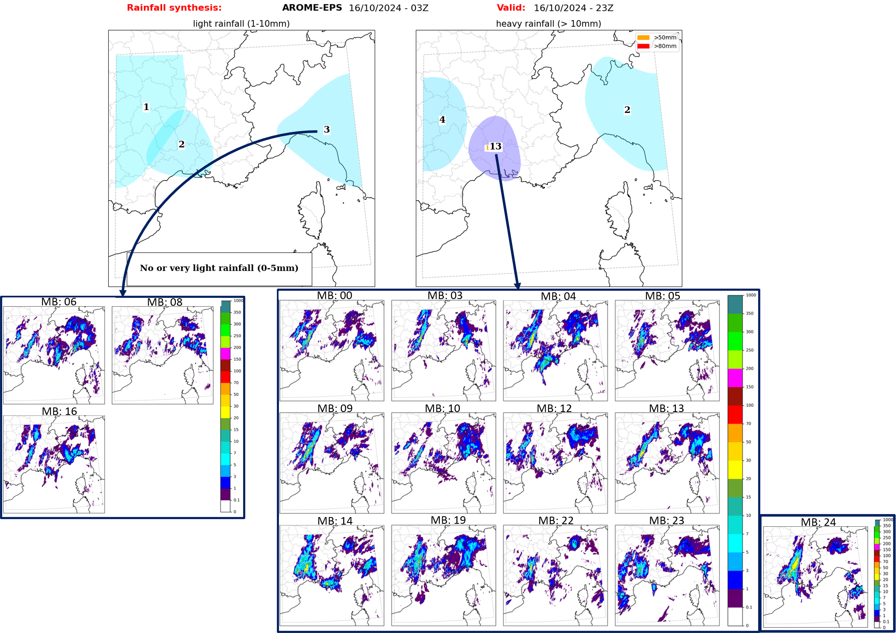

# Rainfall classification 

Public repository for article: "Rainfall Classification from Kilometer-Scale Ensemble Forecasts with Neural Networks":

## Contents

* Compression: codes related to section 2.b, 2.c and 2.d in the article (importance sampling, autoencodeur architecture and implementation). Codes related to PCA and Wavelets (section 3.c) are also in this folder. 
* Evaluation_compression: codes related to section 2.e in the article (object detection and object-oriented scores).
* Clustering_and_final_product: codes related to section 4 (SOM clustering and final product).

:warning: Database, autoencoder weights and SOM are not available. 

## Requirements

Each folder has its own requirement file: 2 yml files and 1 txt for a python virtual environnment. These codes run on different servers with different constraints.

## License

This whole code is under CeCiLL-C license. Text is available [ici](https://cecill.info/licences/Licence_CeCILL-C_V1-fr.html) (in french) and [here](https://cecill.info/licences/Licence_CeCILL-C_V1-en.html)(in english).
